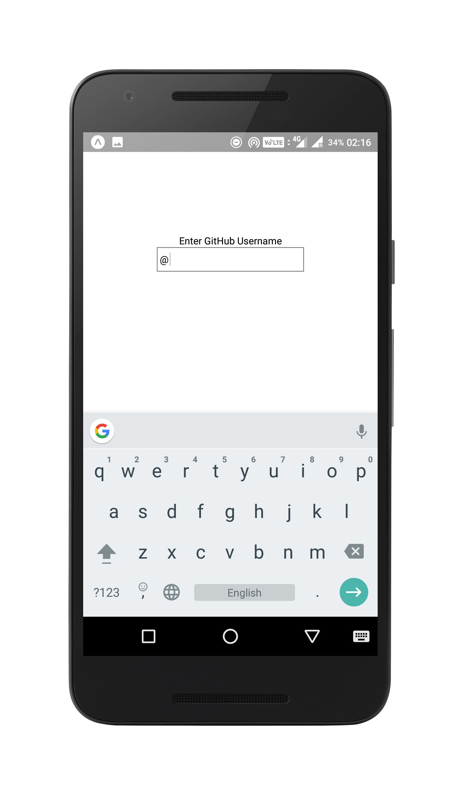
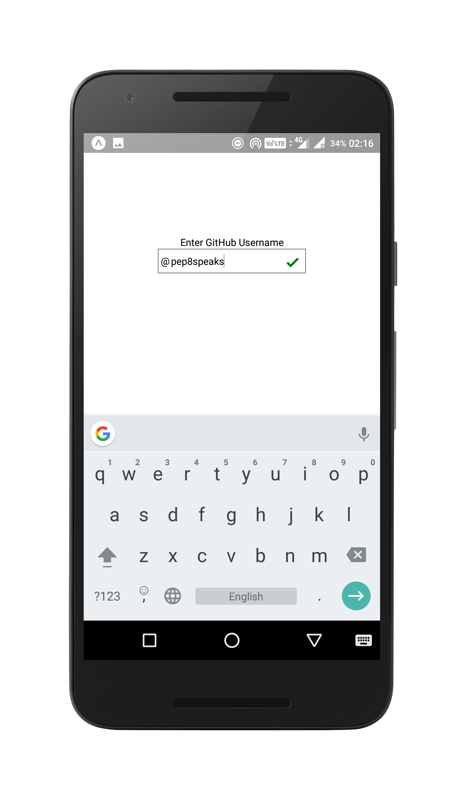
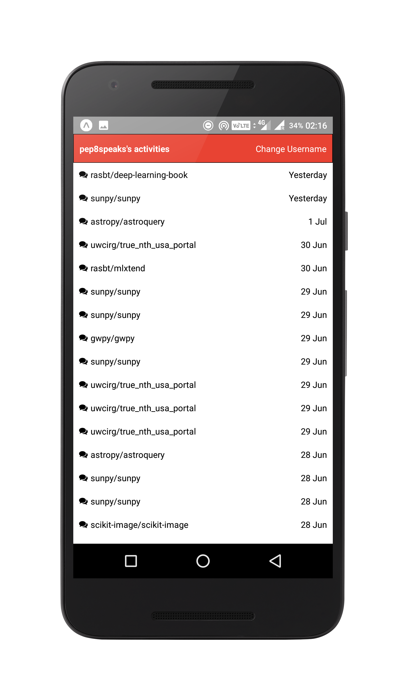

<h1 align="center"></h1>

  
  
  

## What ?

**GitHub Monitor** is a minimalistic react-native app which uses GitHub API to show the activities of a user.

## Why ?

I created it for two of my personal reasons :

1. I have a little bot (@pep8speaks) which I would love to keep track of on my phone.
2. I wanted to make a working android/ios app using react-native.

## How ?

**Insert my medium article here**

## Table of Contents

* [Installation](#installation)
* [Available Scripts](#available-scripts)
  * [npm start](#npm-start)
  * [npm test](#npm-test)
  * [npm run ios](#npm-run-ios)
  * [npm run android](#npm-run-android)
  * [npm run eject](#npm-run-eject)

## Installation

If you trust me enough, install it using the APK I've genereated for the Android people : https://exp-shell-app-assets.s3-us-west-1.amazonaws.com/android%2F%40himanshumishra%2Fgithub-monitor-14d9387f-5f68-11e7-a73f-0a580a781a13-signed.apk

If you do not, or you're crazy to be using an IPhone, this is for you :

1. (Fork) Clone this repository, run `npm install` (Btw. there's something called [pnpm](https://github.com/pnpm/pnpm) in town, check it out)
2. Install the expo app on your phone
3. Start the packager with `npm start`
4. Read whatever gets printed on the console (and follow of course)
5. Once you are done with scanning (and maybe resizing your terminal), shake your phone to get a developer options menu. Click on 'Debug JS Remotely' and a browser tab will open on your computer.
6. Check out the console of the tab and debug away !

## Available Scripts

#### `npm start`

Runs your app in development mode.

Open it in the [Expo app](https://expo.io) on your phone to view it.

#### `npm run ios`

Like `npm start`, but also attempts to open your app in the iOS Simulator if you're on a Mac and have it installed.

#### `npm run android`

Like `npm start`, but also attempts to open your app on a connected Android device or emulator. Requires an installation of Android build tools (see [React Native docs](https://facebook.github.io/react-native/docs/getting-started.html) for detailed setup).

#### `npm run eject`

This will start the process of "ejecting" from Create React Native App's build scripts. You'll be asked a couple of questions about how you'd like to build your project.

**Warning:** Running eject is a permanent action (aside from whatever version control system you use). An ejected app will require you to have an [Xcode and/or Android Studio environment](https://facebook.github.io/react-native/docs/getting-started.html) set up.

## Contribute

I suck at Javascript. And this has to be my first phone app. Please report issues or suggest new features (no matter how small) and I swear by you, I'll try to make it. (Or convince someone else to do it instead.)
